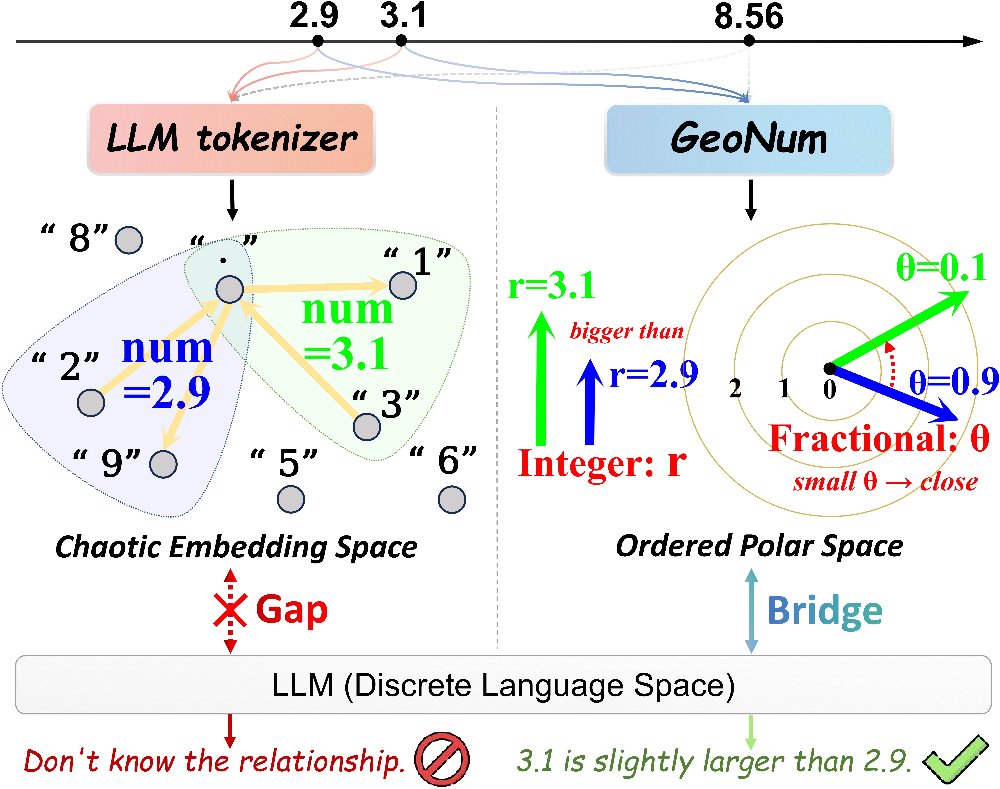
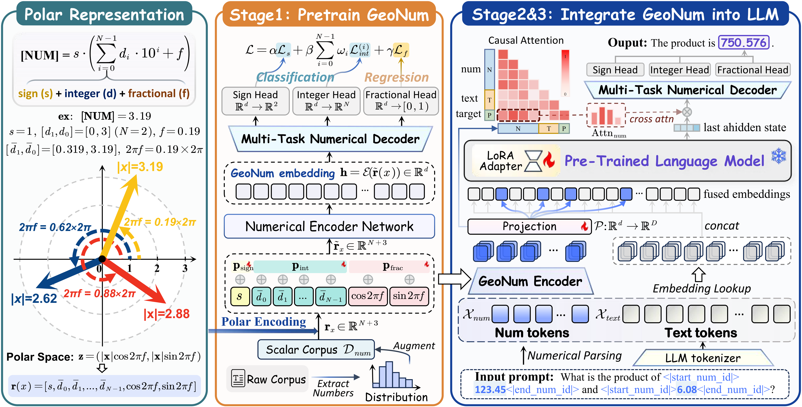

<div align="center">

<h1>GeoNum</h1>

<p><b>GeoNum: Bridging Numerical Continuity and Language Semantics via Geometric Embedding</b></p>

<p>
  Shengkai Jin &nbsp;·&nbsp;
  Tianyu Chen &nbsp;·&nbsp;
  Chonghan Gao &nbsp;·&nbsp;
  Jun Han
</p>

<p><i>Beihang University</i></p>

<p>
  <a href="https://ojs.aaai.org/index.php/AAAI/article/view/39401"></a>
  &nbsp;
  <a href="#citation"></a>
  &nbsp;
  <a href="LICENSE"></a>
</p>

</div>

---

## Overview

LLM tokenizers fragment numerals into inconsistent token sequences, severing the correspondence between numerical proximity and representational similarity. GeoNum resolves this by encoding each scalar as a **geometrically ordered polar embedding**, where numbers close in value are close in embedding space.

<div align="center">
  
  <br>
  <sup>Comparison of LLM tokenizer and GeoNum.</sup>
</div>

<br>

GeoNum decomposes a scalar *x* into a polar feature vector (Eq. 5):

$$r(x) = [s,\ \bar{d}_0,\ \bar{d}_1,\ \ldots,\ \bar{d}_{N-1},\ \cos 2\pi f,\ \sin 2\pi f]$$

where $\bar{d}_i = d_i + (R_i + f)/10^i$ encodes each digit with full carry context (Eq. 4), and the fractional part $f$ is projected onto the unit circle to ensure continuity across digit boundaries. A shared MLP maps $r(x)$ to a $d$-dimensional embedding $h$.

Integration into LLMs follows a **three-stage framework**:

<div align="center">
  
  <br>
  <sup><b>Left:</b> Polar decomposition. &nbsp;<b>Middle:</b> Stage I GeoNum pretraining. &nbsp;<b>Right:</b> Stage II/III alignment and LLM fine-tuning.</sup>
</div>

---

## Repository Structure

```
GeoNum/
├── geonum/
│   ├── encoder.py          # GeoNumEncoder — polar encoding + joint loss (Eq. 2–10)
│   ├── data.py             # ScalarDataset, ArithmeticDataset, evaluation utilities
│   ├── trainer.py          # Logging, numerical loss/decode helpers
│   └── viz.py              # Visualization utilities
├── pretrain_geonum.py      # Stage I: self-supervised polar pretraining
├── finetune_geonum_llm.py  # Stage II & III: alignment and end-to-end fine-tuning
├── visualize_training.py   # Training curve figures
└── datasets/
    ├── nupa/
    ├── numericbench/
    └── fermat/
```

---

## Installation

```bash
pip install torch transformers peft tqdm numpy matplotlib scikit-learn scipy
```

Tested on Python 3.10, PyTorch 2.1, CUDA 11.8 / 12.1.

---

## Usage

### Stage I — Pretraining GeoNum

```bash
python pretrain_geonum.py \
    --data_dir    datasets/nupa \
    --out_dir     results/stage1_nupa \
    --log_uniform --epochs 30 --gpus 0
```

> The encoder checkpoint is saved as `<out_dir>/encoder.pth`.

### Stage II — Projection Alignment

```bash
python finetune_geonum_llm.py \
    --stage        2 \
    --encoder_ckpt results/stage1_nupa/encoder.pth \
    --data_dir     datasets/nupa \
    --out_dir      results/stage2_nupa \
    --gpus         0
```

### Stage III — End-to-End Fine-Tuning

```bash
python finetune_geonum_llm.py \
    --stage        3 \
    --llm_path     /path/to/Llama-3.2-1B-Instruct \
    --encoder_ckpt results/stage1_nupa/encoder.pth \
    --stage2_ckpt  results/stage2_nupa/stage2_best.pth \
    --data_dir     datasets/nupa \
    --out_dir      results/stage2_nupa \
    --gpus         0
```

Supported LLMs: `Llama-3.2-1B-Instruct` (`--llm_dim 2048`), `Llama-3.2-3B-Instruct` (`--llm_dim 3072`).

<details>
<summary><b>Full pipeline / Resume</b></summary>

**Full pipeline** (Stage II then Stage III in one run):

```bash
python finetune_geonum_llm.py \
    --llm_path     /path/to/Llama-3.2-1B-Instruct \
    --encoder_ckpt results/stage1_nupa/encoder.pth \
    --data_dir     datasets/nupa \
    --out_dir      results/stage2_nupa \
    --gpus         0
```

**Resume Stage III** from a saved checkpoint:

```bash
python finetune_geonum_llm.py \
    --stage        3 \
    --llm_path     /path/to/Llama-3.2-1B-Instruct \
    --encoder_ckpt results/stage1_nupa/encoder.pth \
    --stage2_ckpt  results/stage2_nupa/stage2_best.pth \
    --resume_ckpt  results/stage2_nupa/stage3_best.pth \
    --data_dir     datasets/nupa \
    --out_dir      results/stage2_nupa \
    --gpus         0
```

</details>

Each run writes `train.log`, `progress.log`, `training.png`, and JSONL logs to `--out_dir`.

### Visualization

```bash
# Stage II / III training curves
python visualize_training.py --out_dir results/stage2_nupa
```

---

## Citation

<a id="citation"></a>

If you find this work useful, please cite:

```bibtex
@inproceedings{jin2026geonum,
  title     = {GeoNum: Bridging Numerical Continuity and Language Semantics via Geometric Embedding},
  author    = {Jin, Shengkai and Chen, Tianyu and Gao, Chonghan and Han, Jun},
  booktitle = {Proceedings of the AAAI Conference on Artificial Intelligence},
  volume    = {40},
  number    = {27},
  pages     = {22426--22434},
  year      = {2026},
  doi       = {10.1609/aaai.v40i27.39401}
}
```
